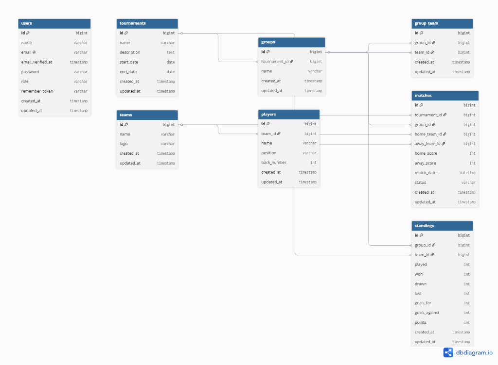

# Project UTS - Laravel Web Application

## 1. Identitas
* **Nama:** Levy Danendra Fahriza Zani
* **NIM:** 2305101032
* **Kelas:** 6B
* **Mata Kuliah:** Pemrograman Web
* **Repository URL:** [https://github.com/levydanendra775/Project-UTS-Laravel](https://github.com/levydanendra775/Project-UTS-Laravel)

---

## 2. Persyaratan Sistem (System Requirements)
Sebelum menjalankan proyek ini, pastikan perangkat kamu sudah memenuhi spesifikasi minimum berikut:

* **PHP:** Version 8.1 atau lebih tinggi
* **Composer:** Version 2.0 atau lebih tinggi
* **Database:** MySQL / MariaDB (atau XAMPP/Laragon)
* **Web Server:** Apache / Nginx (Sudah include di XAMPP/Laragon)
* **Node.js & NPM:** (Opsional, jika proyek menggunakan Vite/Mix untuk frontend asset)

---

## 3. Cara Menjalankan Project / Panduan Instalasi

Ikuti langkah-langkah di bawah ini untuk menjalankan proyek di komputer lokal Anda:

### Langkah 1: Clone Repository
Buka terminal atau Git Bash, lalu jalankan perintah berikut untuk menyalin proyek:
```bash
git clone https://github.com/levydanendra775/Project-UTS-Laravel.git
cd Project-UTS-Laravel
```

### Langkah 2: Setup Environment Variables
Salin file `.env.example` dan ubah namanya menjadi `.env`. Setelah itu, generate application key dengan perintah:
```bash
cp .env.example .env
php artisan key:generate
```

### Langkah 3: Setup Database
Buka phpMyAdmin atau aplikasi manajemen database lainnya, lalu buat database baru (misalnya dengan nama `db_futsal_tournament`).

Buka file `.env` di text editor, lalu sesuaikan konfigurasi koneksi database berikut:
```env
DB_CONNECTION=mysql
DB_HOST=127.0.0.1
DB_PORT=3306
DB_DATABASE=db_futsal_tournament
DB_USERNAME=root
DB_PASSWORD=
```

### Langkah 4: Jalankan Migrasi & Seeder
Untuk membuat struktur tabel dan mengisi data awal (dummy data) secara otomatis, jalankan perintah ini di Terminal:
```bash
php artisan migrate --seed
```

### Langkah 5: Jalankan Local Server
Setelah semua setup selesai, jalankan server Laravel dengan perintah:
```bash
php artisan serve
```
Server akan berjalan dan dapat diakses melalui browser di: http://127.0.0.1:8000.

---

## 4. Pengujian (Testing)
* **Akses Web:** Silakan buka [http://127.0.0.1:8000](http://127.0.0.1:8000) di browser untuk melihat dan berinteraksi dengan antarmuka aplikasi.
* **Pengujian API (Opsional):** Jika proyek ini mencakup pembuatan API, Anda dapat meng-import file Collection Postman (`Futsal_Tournament.postman_collection.json`) yang telah disertakan di dalam repository ini ke dalam aplikasi Postman Anda untuk menguji seluruh endpoint dan error handling yang sudah dikonfigurasi.

---

## 5. Testing & Dokumentasi API (postman)
Berikut adalah beberapa tampilan antarmuka (interface) dari aplikasi Futsal Tournament:

1. **Landing Page**
   

2. **Halaman Login**
   

3. **Aksi Login Admin**
   

4. **Dashboard Admin**
   

5. **Form Pembuatan Tim**
   

6. **Aksi Pembuatan Tim**
   

7. **Daftar Tim & Validasi**
   

8. **Detail Turnamen**
   

9. **Halaman Bracket Turnamen (Knockout)**
   

10. **Aksi Logout**
    

---

## ERD Database & Relasi

Berikut adalah diagram ERD (Entity Relationship Diagram) dari database aplikasi Futsal Tournament:



### Penjelasan Relasi Antar Tabel

1. **`users`**
   - Tabel ini bersifat mandiri (*standalone*) dan digunakan untuk mengelola data pengguna (nama, email, password, role) dalam sistem, seperti autentikasi admin atau panitia turnamen.

2. **`tournaments`**
   - **Hubungan dengan `groups` (One-to-Many):** Satu turnamen (`tournaments`) dapat memiliki banyak grup (`groups`). Relasi ini dihubungkan melalui foreign key `tournament_id` pada tabel `groups`.
   - **Hubungan dengan `matches` (One-to-Many):** Satu turnamen dapat mengadakan banyak pertandingan (`matches`). Relasi ini dihubungkan melalui foreign key `tournament_id` pada tabel `matches`.

3. **`groups`**
   - **Hubungan dengan `group_team` (One-to-Many):** Menghubungkan grup dengan tim yang berpartisipasi di dalamnya. Dihubungkan melalui foreign key `group_id` pada tabel `group_team`.
   - **Hubungan dengan `matches` (One-to-Many):** Satu grup memiliki banyak jadwal pertandingan. Dihubungkan melalui foreign key `group_id` pada tabel `matches`.
   - **Hubungan dengan `standings` (One-to-Many):** Klasemen grup dihubungkan melalui foreign key `group_id` pada tabel `standings`.

4. **`teams`**
   - **Hubungan dengan `players` (One-to-Many):** Satu tim (`teams`) dapat memiliki banyak pemain (`players`). Dihubungkan melalui foreign key `team_id` pada tabel `players`.
   - **Hubungan dengan `group_team` (One-to-Many):** Menghubungkan tim ke dalam grup tertentu. Dihubungkan melalui foreign key `team_id` pada tabel `group_team`.
   - **Hubungan dengan `matches` (One-to-Many, ganda):** Satu tim dapat bertindak sebagai Tim Kesatu (`team1_id`) atau Tim Kedua (`team2_id`) dalam suatu pertandingan. Dihubungkan melalui foreign key `team1_id` dan `team2_id` pada tabel `matches`.
   - **Hubungan dengan `standings` (One-to-Many):** Menghubungkan performa tim di klasemen grup melalui foreign key `team_id` pada tabel `standings`.

5. **`group_team`**
   - Merupakan tabel pivot (*pivot table*) yang merepresentasikan hubungan Many-to-Many antara tabel `groups` dan `teams`. Setiap baris mencatat tim mana saja yang masuk ke dalam grup mana.

6. **`players`**
   - Setiap pemain terikat pada satu tim tertentu melalui foreign key `team_id`. Tabel ini menyimpan detail informasi pemain seperti nama, posisi, nomor punggung, dan tanggal lahir.

7. **`matches`**
   - Menyimpan informasi detail pertandingan futsal. Tabel ini mereferensikan:
     - `tournament_id` ke tabel `tournaments` (menunjukkan pertandingan ini bagian dari turnamen apa).
     - `group_id` ke tabel `groups` (menunjukkan pertandingan di grup mana, bernilai *nullable* untuk fase knockout).
     - `team1_id` dan `team2_id` ke tabel `teams` (menunjukkan kedua tim yang bertanding).
     - `winner_id` ke tabel `teams` (menunjukkan tim pemenang).

8. **`standings`**
   - Menyimpan data klasemen sementara untuk setiap grup. Tabel ini mereferensikan `tournament_id` (tabel `tournaments`), `group_id` (tabel `groups`), dan `team_id` (tabel `teams`) untuk menghitung performa tim (jumlah main, menang, seri, kalah, gol memasukkan, gol kemasukan, selisih gol, dan poin total).

---

## Struktur Tabel Database

| Tabel | Kolom |
| :--- | :--- |
| **`users`** | `id`, `name`, `email`, `password`, `role (enum: admin, panitia)`, `remember_token`, `timestamps` |
| **`teams`** | `id`, `name`, `logo (nullable)`, `coach_name`, `description (text, nullable)`, `timestamps` |
| **`players`** | `id`, `team_id (FK)`, `name`, `back_number`, `position`, `birth_date (date)`, `timestamps` |
| **`tournaments`** | `id`, `name`, `status (enum: draft, ongoing, completed)`, `start_date (date)`, `end_date (date)`, `timestamps` |
| **`groups`** | `id`, `tournament_id (FK)`, `name`, `timestamps` |
| **`group_team`** | `group_id (FK)`, `team_id (FK)` |
| **`matches`** | `id`, `tournament_id (FK)`, `group_id (FK, nullable)`, `round (enum: group, quarterfinal, semifinal, final)`, `team1_id (FK)`, `team2_id (FK)`, `team1_score (nullable)`, `team2_score (nullable)`, `winner_id (FK, nullable)`, `match_date (datetime)`, `status (enum: scheduled, played)`, `timestamps` |
| **`standings`** | `id`, `tournament_id (FK)`, `group_id (FK)`, `team_id (FK)`, `played (int)`, `won (int)`, `drawn (int)`, `lost (int)`, `goals_for (int)`, `goals_against (int)`, `goals_difference (int)`, `points (int)`, `timestamps` |

---

## Relasi Eloquent

```text
Tournament       -> hasMany        -> Group
Tournament       -> hasMany        -> TournamentMatch
Tournament       -> hasMany        -> Standing
Group            -> belongsTo      -> Tournament
Group            -> belongsToMany  -> Team
Group            -> hasMany        -> TournamentMatch
Group            -> hasMany        -> Standing
Team             -> hasMany        -> Player
Team             -> belongsToMany  -> Group
Team             -> hasMany        -> Standing
Team             -> hasMany        -> TournamentMatch (sebagai team1 / home)
Team             -> hasMany        -> TournamentMatch (sebagai team2 / away)
Player           -> belongsTo      -> Team
TournamentMatch  -> belongsTo      -> Tournament
TournamentMatch  -> belongsTo      -> Group
TournamentMatch  -> belongsTo      -> Team (sebagai team1)
TournamentMatch  -> belongsTo      -> Team (sebagai team2)
TournamentMatch  -> belongsTo      -> Team (sebagai winner)
Standing         -> belongsTo      -> Tournament
Standing         -> belongsTo      -> Group
Standing         -> belongsTo      -> Team
```

---

## Daftar Endpoint API

| Modul | Method | Endpoint (Route) | Deskripsi & Akses |
| :--- | :--- | :--- | :--- |
| **Auth** | `GET` | `/login` | Tampilan halaman login (Guest) |
| | `POST` | `/login` | Proses autentikasi login (Guest) |
| | `GET` | `/register` | Tampilan halaman pendaftaran (Guest) |
| | `POST` | `/register` | Proses pendaftaran pengguna baru (Guest) |
| | `POST` | `/logout` | Logout dari sistem dan menghapus session (Semua User Terautentikasi) |
| **Dashboard**| `GET` | `/dashboard` | Menampilkan dashboard statistik utama (Admin & Panitia) |
| **Teams** | `GET` | `/teams` | Menampilkan daftar seluruh tim futsal (Admin Only) |
| | `POST` | `/teams` | Menyimpan data tim futsal baru (Admin Only) |
| | `GET` | `/teams/create` | Form untuk mendaftarkan tim futsal baru (Admin Only) |
| | `GET` | `/teams/{team}` | Menampilkan detail profil tim futsal tertentu (Admin Only) |
| | `GET` | `/teams/{team}/edit` | Form untuk mengubah profil tim futsal tertentu (Admin Only) |
| | `PUT`/`PATCH`| `/teams/{team}` | Memperbarui profil tim futsal tertentu (Admin Only) |
| | `DELETE` | `/teams/{team}` | Menghapus tim futsal dari sistem (Admin Only) |
| **Players** | `GET` | `/players` | Menampilkan daftar seluruh pemain (Admin Only) |
| | `POST` | `/players` | Menyimpan data pemain baru (Admin Only) |
| | `GET` | `/players/create` | Form untuk menambahkan pemain baru (Admin Only) |
| | `GET` | `/players/{player}` | Menampilkan detail profil pemain tertentu (Admin Only) |
| | `GET` | `/players/{player}/edit`| Form untuk mengubah profil pemain tertentu (Admin Only) |
| | `PUT`/`PATCH`| `/players/{player}` | Memperbarui profil pemain tertentu (Admin Only) |
| | `DELETE` | `/players/{player}` | Menghapus data pemain dari sistem (Admin Only) |
| **Tournaments**| `GET` | `/tournaments` | Menampilkan daftar turnamen kelolaan (Admin Only) |
| | `POST` | `/tournaments` | Membuat data turnamen futsal baru (Admin Only) |
| | `GET` | `/tournaments/create`| Form untuk membuat turnamen baru (Admin Only) |
| | `GET` | `/tournaments/{tournament}/edit`| Form untuk mengubah data turnamen (Admin Only) |
| | `PUT`/`PATCH`| `/tournaments/{tournament}`| Memperbarui data turnamen (Admin Only) |
| | `DELETE` | `/tournaments/{tournament}`| Menghapus turnamen dari database (Admin Only) |
| | `GET` | `/tournaments/{tournament}`| Detail turnamen & manajemen grup/fase (Admin & Panitia) |
| | `GET` | `/tournaments/{tournament}/knockout`| Panel bracket fase knockout admin (Admin & Panitia) |
| | `GET` | `/tournaments/{tournament}/pdf`| Generate dan unduh PDF laporan turnamen (Admin & Panitia) |
| **Groups** | `GET` | `/tournaments/{tournament}/groups/create`| Form untuk menambahkan grup di turnamen (Admin Only) |
| | `POST` | `/tournaments/{tournament}/groups`| Menyimpan grup baru di dalam turnamen (Admin Only) |
| | `DELETE` | `/groups/{group}` | Menghapus grup dari turnamen (Admin Only) |
| | `GET` | `/groups/{group}/teams`| Form untuk mengelola pembagian tim ke dalam grup (Admin Only) |
| | `POST` | `/groups/{group}/teams`| Memperbarui pembagian tim dalam grup (Admin Only) |
| **Knockout** | `POST` | `/tournaments/{tournament}/knockout/initialize-quarterfinals`| Menginisialisasi bracket perempat final (Admin Only) |
| | `POST` | `/tournaments/{tournament}/knockout/initialize-semifinals`| Menginisialisasi bracket semifinal (Admin Only) |
| **Matches** | `GET` | `/tournaments/{tournament}/matches/create`| Form pembuatan jadwal pertandingan manual (Admin & Panitia) |
| | `POST` | `/tournaments/{tournament}/matches`| Menyimpan jadwal pertandingan baru manual (Admin & Panitia) |
| | `POST` | `/tournaments/{tournament}/matches/generate`| Generate otomatis jadwal pertandingan penyisihan grup (Admin & Panitia) |
| | `GET` | `/matches/{match}/edit`| Form pengubahan jadwal pertandingan (Admin & Panitia) |
| | `PUT`/`PATCH`| `/matches/{match}` | Memperbarui jadwal pertandingan (Admin & Panitia) |
| | `DELETE` | `/matches/{match}` | Menghapus pertandingan dari jadwal (Admin & Panitia) |
| | `GET` | `/matches/{match}/score`| Form pengisian hasil skor pertandingan (Admin & Panitia) |
| | `POST` | `/matches/{match}/score`| Menyimpan skor gol dan pemenang pertandingan (Admin & Panitia) |
| **Public View**| `GET` | `/` | Tampilan Landing Page umum (Semua Pengguna / Guest) |
| | `GET` | `/public/tournaments/{tournament}`| Tampilan klasemen & jadwal publik turnamen tertentu (Semua Pengguna) |
| | `GET` | `/public/tournaments/{tournament}/knockout`| Tampilan bagan/bracket fase knockout publik (Semua Pengguna) |


